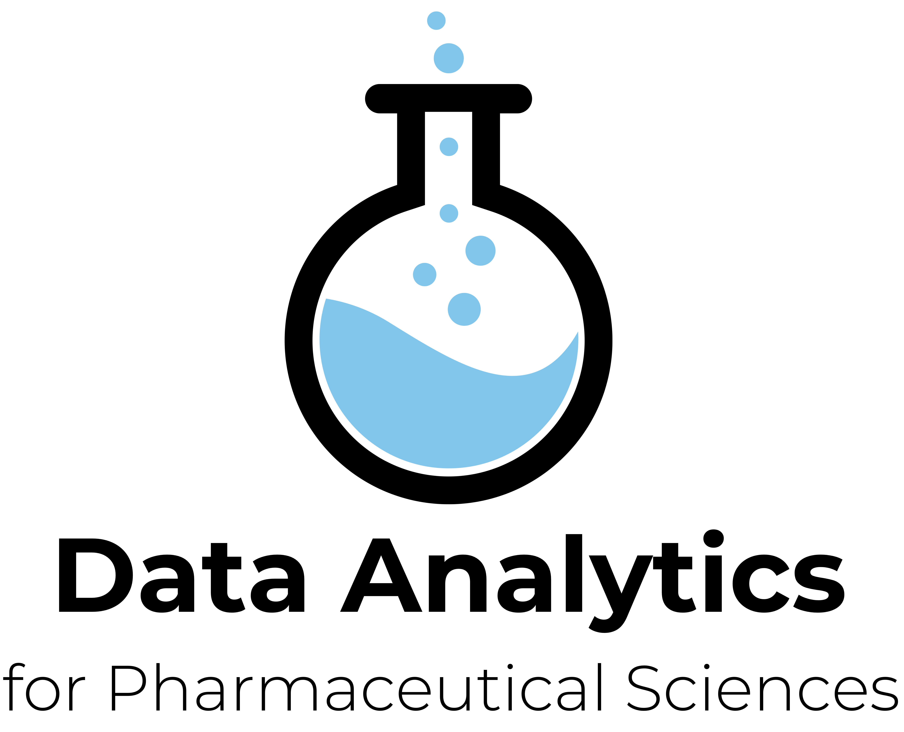

<p align="center">

</p>

# `idar`
Package for class "Modelling and Data Analysis for Pharmaceutical Science" (`idar`, which stands for Introduction to Data Analytics with `R`=)

# Installation
You can install `idar` from github with:

```
# install.packages("devtools")
devtools::install_github("SMAC-Group/idar")
```

# Loading data
`idar` proposes various dataset to work with. Namely, 

- `bronchitis`
- `codex`
- `cortisol`
- `covid`
- `diet`
- `pharmacy`
- `reading`
- `students`

To load a dataset, assuming that `idar` is loaded in your environnement (`library(idar)`), you can use:
```
data(dataset_name)
```

You can obtain the description of the dataset with:
```
help(dataset_name)
```
